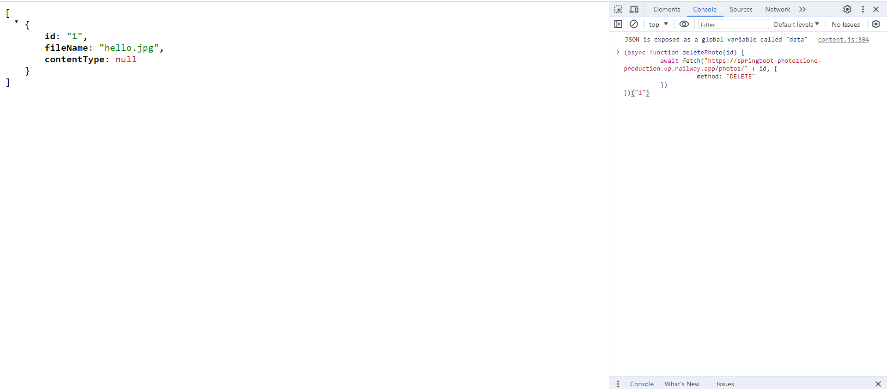
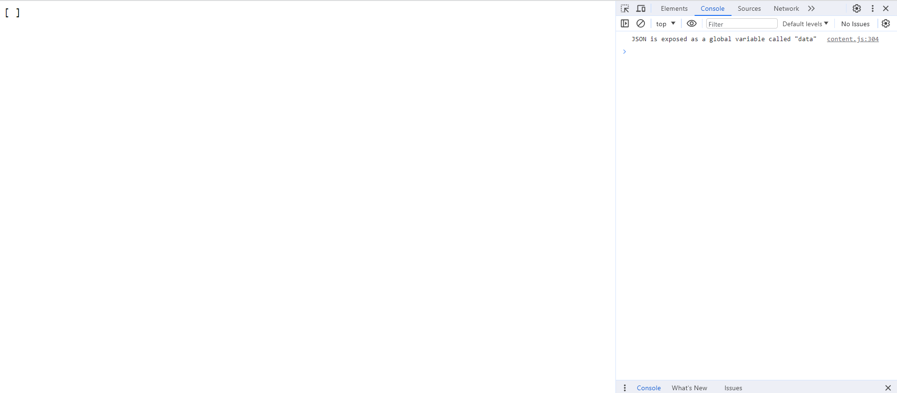
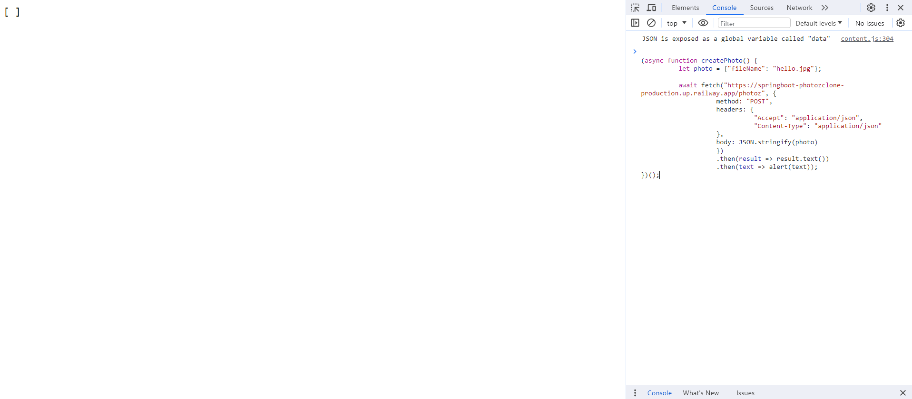
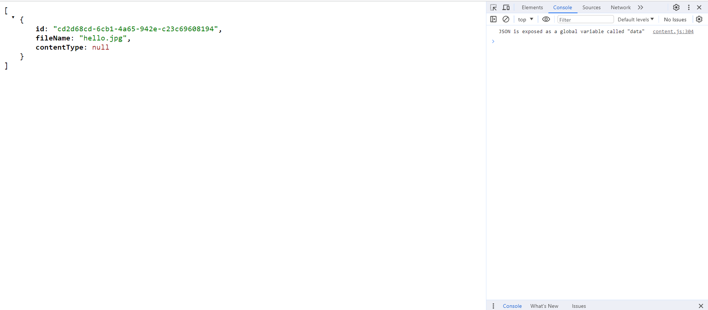

# Project Demo

https://springboot-photozclone-production.up.railway.app/

# Read photos

### Code

```
 @GetMapping("/")
    public String hello() {
        return "Hello World";
    }
```

### Endpoint

https://springboot-photozclone-production.up.railway.app/


## Get all photos

### Code

```
   @GetMapping("/photoz")
    public Collection<Photo> get() {
        return photozService.get();
    }
```

### Endpoint

https://springboot-photozclone-production.up.railway.app/photoz


## Get the photo by id

### Code

```
   @GetMapping("/photoz/{id}")
    public Photo get(@PathVariable String id) {
        Photo photo = photozService.get(id);
        if (photo == null) throw new ResponseStatusException(HttpStatus.NOT_FOUND);
        return photo;
    }
```

### Endpoint

https://springboot-photozclone-production.up.railway.app/photoz/1


# Delete the photo by id

### Code

```
    @DeleteMapping("/photoz/{id}")
    public void delete(@PathVariable String id) {
        Photo photo = photozService.remove(id);
        if (photo == null) throw new ResponseStatusException(HttpStatus.NOT_FOUND);
    }
```

### Endpoint

https://springboot-photozclone-production.up.railway.app/photoz

```
(async function deletePhoto(id) {
          await fetch("https://springboot-photozclone-production.up.railway.app/photoz/" + id, {
                    method: "DELETE"
          })
})("1")
```




# Create photos

### Code

```
   @PostMapping("/photoz")
    public Photo create(@RequestBody Photo photo){
        return photozService.save(photo.getFileName(), photo.getContentType(), photo.getData());
    }
```

### Endpoint

https://springboot-photozclone-production.up.railway.app/photoz

```
(async function createPhoto() {
          let photo = {"fileName": "hello.jpg"};

          await fetch("https://springboot-photozclone-production.up.railway.app/photoz", {
                    method: "POST",
                    headers: {
                              "Accept": "application/json",
                              "Content-Type": "application/json"
                    },
                    body: JSON.stringify(photo)
                    })
                    .then(result => result.text())
                    .then(text => alert(text));
})();
```



